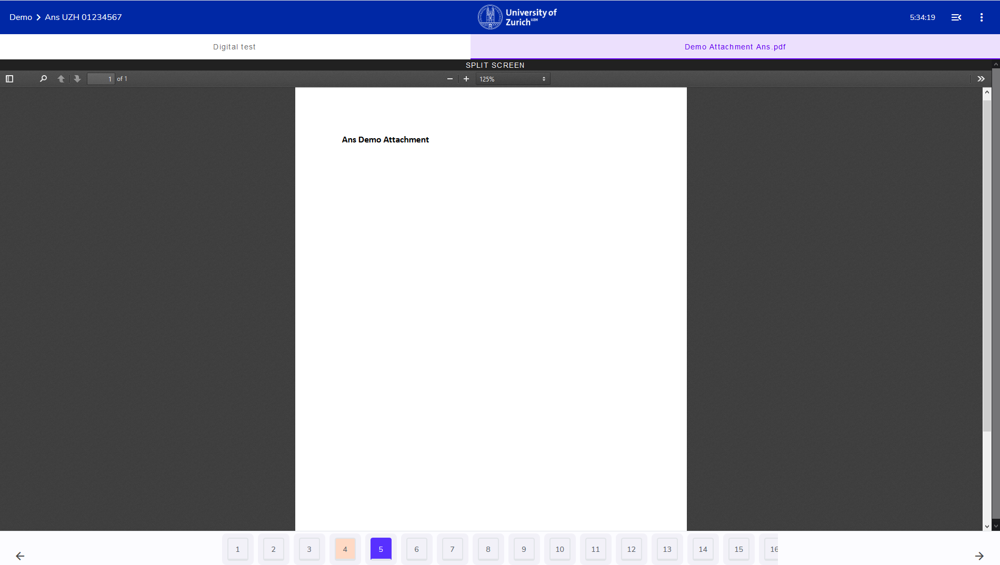

## Attachments

Depending on the exam, there will be additional documents provided. 
These attachement will be visible in the **upper** section of the screen:

1. To view an attachment, click on the name of the document. Here:**Demo Attachment Ans.pdf**

1. Make us of the **Split Screen** function in order to see the exam and the attachement side by side (disable it by clicking on the black **Split Screen** bar once more)

   **Split Screen Visualisation**

