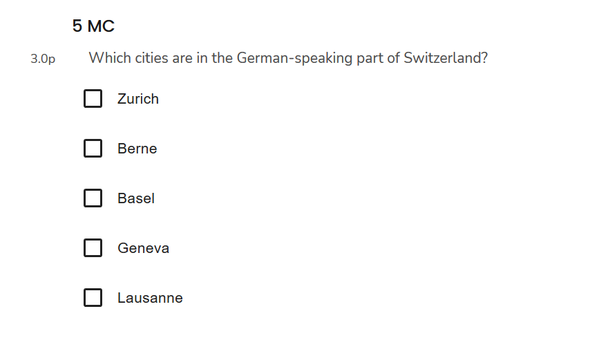
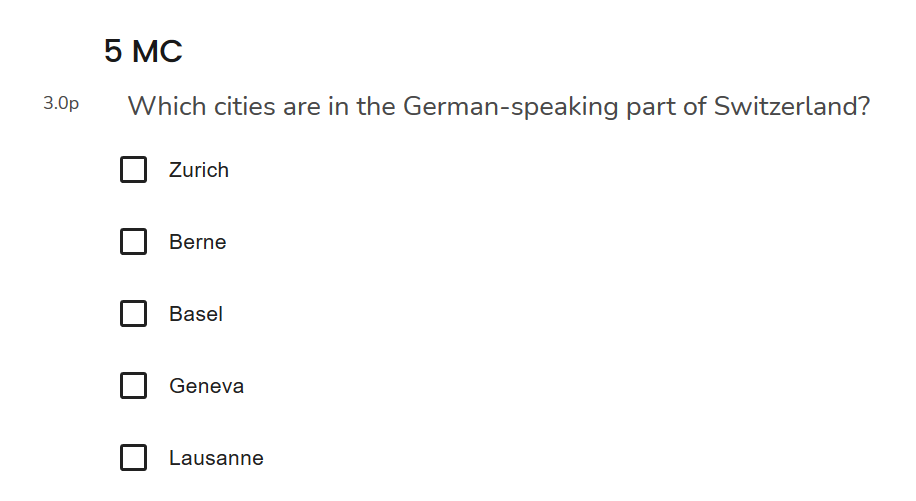
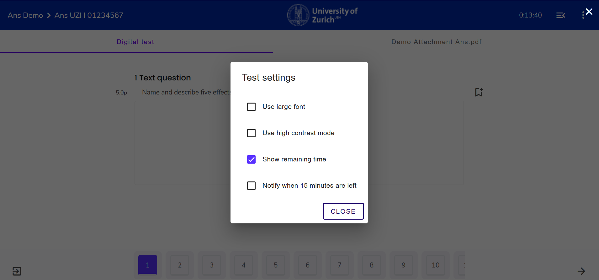

## Exam Settings

To adjust the settings within an exam, you need to be within an exam mode:

1. Navigate to the **top-right** corner and click on the **3-dots-icon**. Select **Settings**:

1. A pop-up appears in the middle of the screen displaying the settings:

---

You can adjust the following:
* **font size**
* **contrast**
* **remaining time**
* **notify when 15 minutes are left** 

1. **font size**
Select the box "Use large font", to enlarge the font. 
Font comparison:
* Normal: 
* Large: 

1. **Contrast**
Select the box "Use high contrast mode", to active the contrast:

1. **Remaining Time**
Select the box "Show Remaining Time" , to have the remaining time displayed in the **top-right** corner:

1. **notify when 15 minutes are left**
Select the box "Notify when 15 minutes are left" to get a pop-up notification 15 minutes before the end of the exam.

