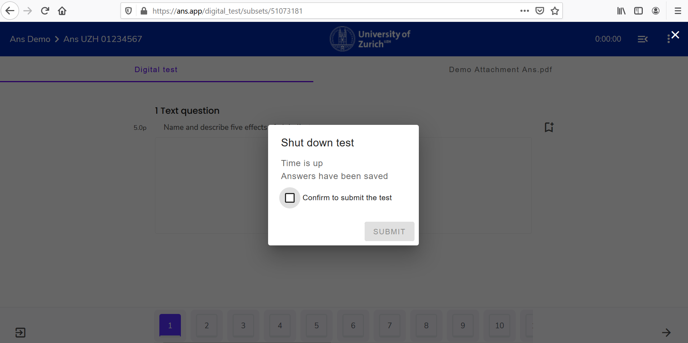
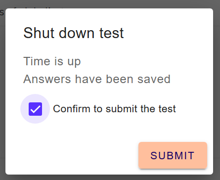

## Finish an exam
{: .no_toc }
The procedure for stopping and pausing the test is described below.

1. Inhaltsübersicht
{:toc}

---

### Submit examination independently

If you want to end the test, you have 2 options:

* Option 1: Select the last navigation arrow:
If you have reached the last question, the following icon is visible at the bottom right of the screen:  

* Option 2: Exit using the **"3-dot"-icon** **at the top-right** of the screen:
Click on the **"3-dots"-icon** and select **Exit Test**:  

Both options will then display the same pop-up:

Please tick the box **Confirm to submit the test** and press **Submit**.

**Attention**: Submitting an exam is **NOT** reversible. If you are unsure whether you are ready to submit or accidentally selected the last arrow and the pop-up appears, press the ESC-Button on your keyboard.

### Exam time has elapsed
Once the exam time has elapsed, a pop-up appears which asks you to submit your exam:

Please tick the box and press **Submit** to hand in your exam:

