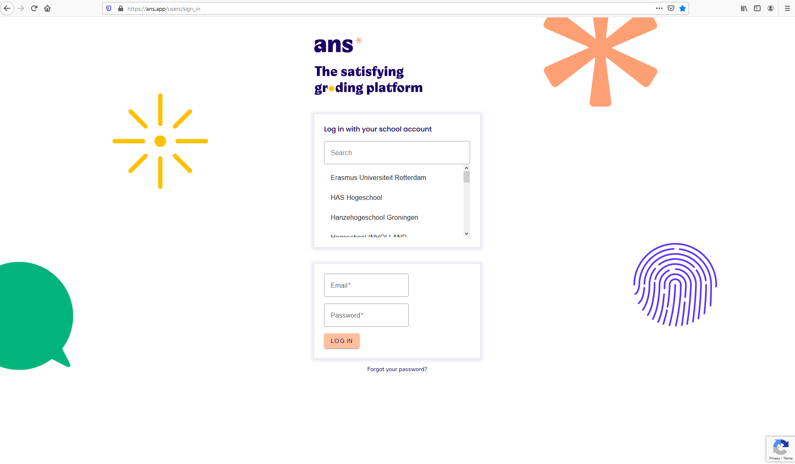
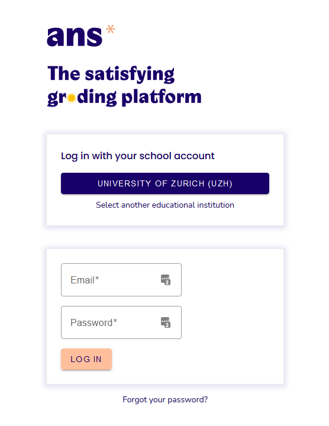

## Ans Login

1. Click [here](https://ans.app/users/sign_in){:target="_blank"} or copy the following link [https://ans.app/users/sign_in](https://ans.app/users/sign_in){:target="_blank"} into your browser (Firefox or Chrome).

1. Select **Log in with your school account** and insert “University of Zurich” or "UZH" into the search bar:     

1. Once “University of Zurich (UZH)" has been selected, you are being redirected to the AAI-Login of University of Zurich where you are logging in using your shortname and the corresponding password:

1. If your login was successful, you will see your name and the institution - University of Zurich - in the upper left corner:

***

**Note:** After logging in for the first time, the institution setting is already pre-recorded:

***

In case of login problems please contact: [support@oec.uzh.ch](mailto:support@oec.uzh.ch)
