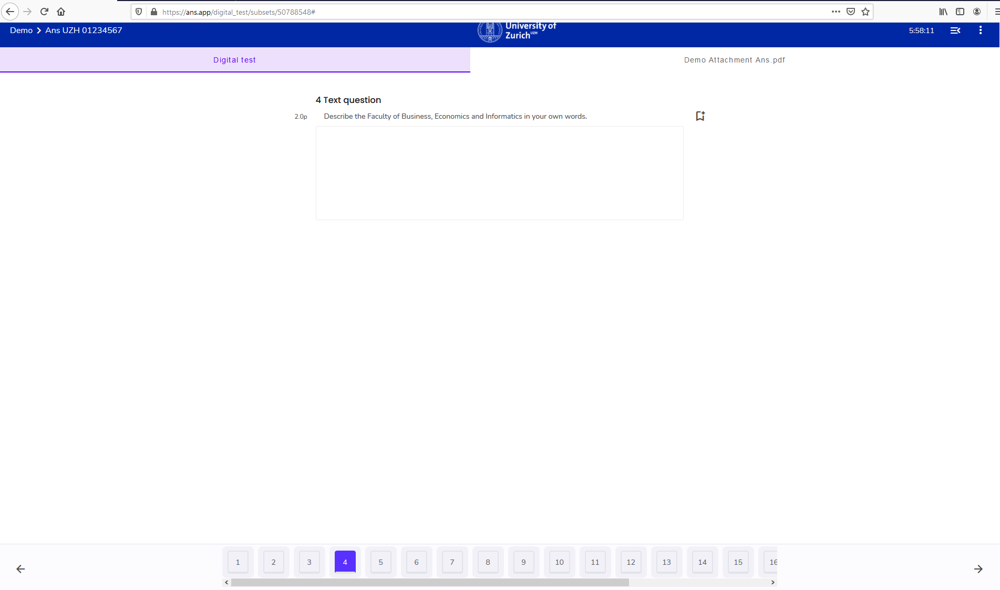

## Exam Navigation
{: .no_toc }

There are two orientations available to you during the exam:
1. Table of contents
{:toc}

---

### Navigation bar

Navigate by using the question bar at the **bottom** of your exam window:

1. Option: Navigate using the arrows
**Back** to the previous question with ← (In screenshot: bottom left).
**Next** to the next question with → (In screenshot: bottom right)

1. Option: select specific question
Select any page / question:

**Note:** Depending on the navigationrestrictions set by the examiner answered questions are either displayed with a lock (a question can only be looked once) or are marked "orange".

### Exam overview

Apart from the bottom question bar, there is also the **side bar**, which can be unfolded **top-right** with the following icon:  

The sidebar gives an overview of the questions with question type and score. Furthermore, the progress of the exam is displayed by means of the percentage of answered questions and the maximum score of the questions already answered: 

**Note**: the sidebar is static, so it is not possible to click on a question to get there. Please use the [question bar] for that.(#Navigation-bar).

