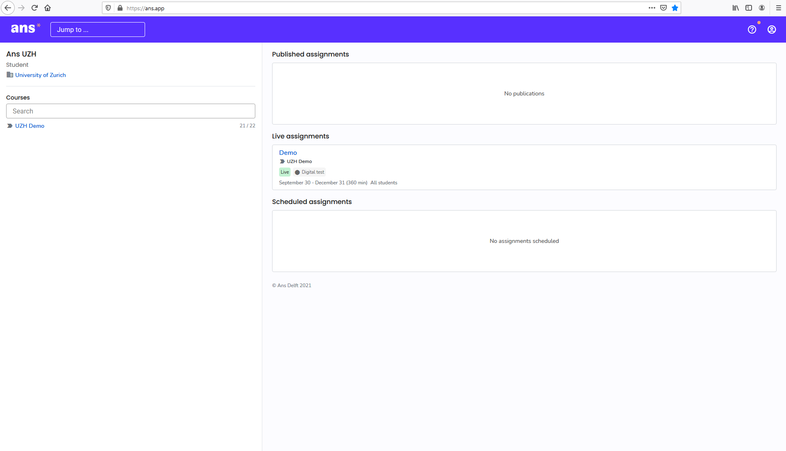
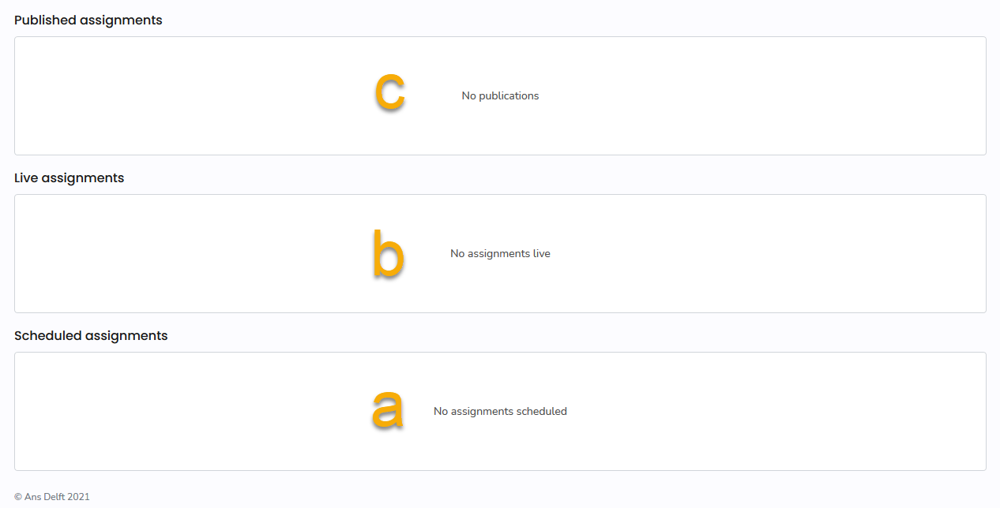
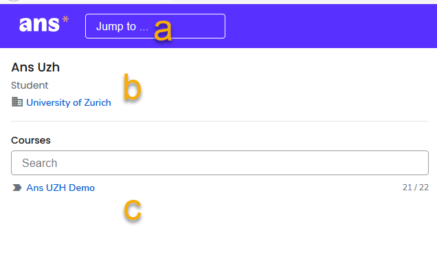
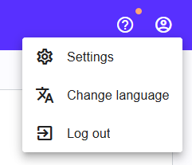
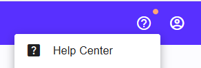

## Platform overview (Overview)
{: .no_toc }
When you log in to Ans you will see the following view:

The individual components are explained below.

1. Table of content
{:toc}

---

### Right side - overview of your exams and assignements
On the right hand side you can see the respective assignments:
* Scheduled assignements (a)
* Live assignements (b)
* Published assignements (c)

### Top-Left side - course overview and search bar
On the left hand side you can see:
* the search bar (a)
* Your name and institutin (b)
* Courses: Courses and modules in which you have been enrolled in (c)

### Top-right corner - Settings and help
In the top right corner you can seee:
* The profile-icon containing the settings and optino to logout 

* The help symbol [Help Center](https://support.ans.app/hc/en-us){:target="_blank"} for further information / instructions

