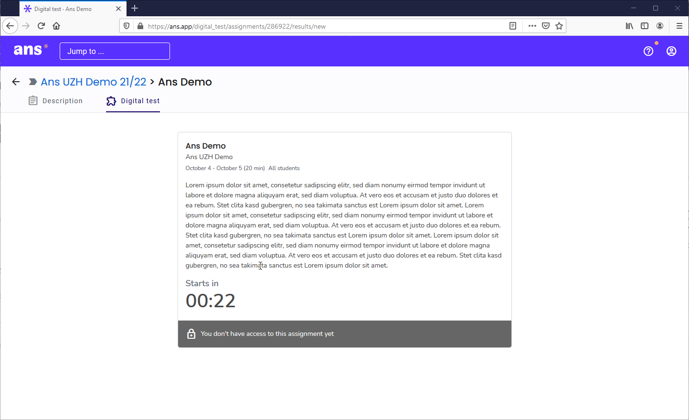
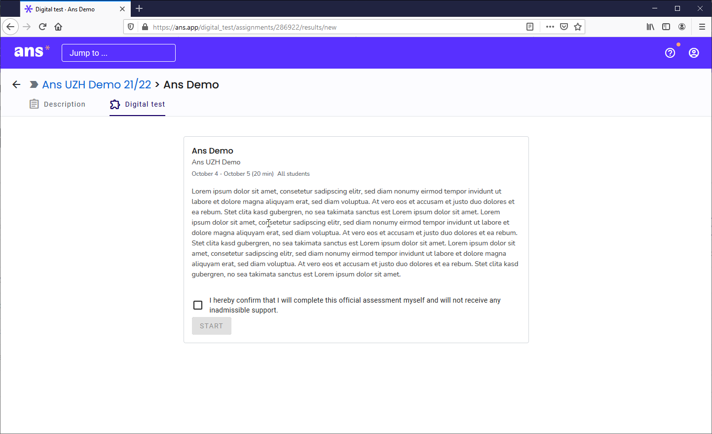

## Start an exam

Before the start time of an exam you will find it within "Scheduled assignments":

1. If you select the exam within the scheduled Assignement a countdown appears:

1. As soon as the countdown drops to **00:00** the page is automatically refreshed. (if the exam has alraedy started, there will be no countdown)

1. Once you have accepted the code of honor you can then click the **start**-button:

**Note**: If your exam set up is using Ans in conjuntion with the Safe Exam Browser, the prcess to start an exam is different. For further information please see the respective chapter:
* [Ans & SEB with Windows](https://uzh-oec.github.io/ans-en/exam_seb_ans_win_en.html){:target="_blank"}.
* [Ans & SEB with MacOS](https://uzh-oec.github.io/ans-en/exam_seb_ans_mac_en.html){:target="_blank"}.

